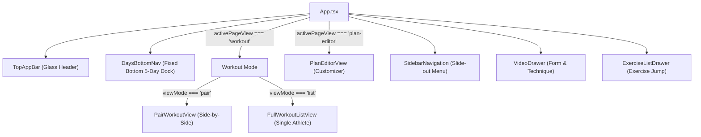

# Pulse UI Architecture & Design Documentation

Welcome to the comprehensive UI documentation for **Pulse**, a mobile-first partner fitness application built for high-performance gym workouts.

---

## 🏛️ UI Tech Stack & Core Philosophy

Pulse is designed around a single guiding principle: **zero friction during intense gym training**. Athletes should be able to log working sets, track rest periods, and coordinate superset stations with one thumb under direct gym lighting.

```
┌─────────────────────────────────────────────────────────────┐
│                    Vite + React 19 SPA                      │
├──────────────────────────────┬──────────────────────────────┤
│ Visual & Interaction Layer   │ State & Audio/Haptics        │
│ • Tailwind CSS & CSS Tokens  │ • Dual Offline/Edge Sync     │
│ • Porcelain & Slate Theme    │ • Web Audio API Synthesizer  │
│ • Liquid Glass Specular Blur │ • Web Vibration Haptics      │
│ • Motion Spring Physics      │ • Optimistic Local State     │
└──────────────────────────────┴──────────────────────────────┘
```

- **Framework**: [React 19](https://react.dev/) + [TypeScript](https://www.typescriptlang.org/)
- **Styling**: [Tailwind CSS](https://tailwindcss.com/) + Custom CSS Custom Properties (`src/index.css`)
- **Animations**: [Motion](https://motion.dev/) (formerly Framer Motion)
- **Icons**: [Lucide React](https://lucide.dev/)
- **Sensory Feedback**: Custom Web Audio Synthesizer (`src/lib/audio.ts`) + Haptic Feedback Driver (`src/lib/haptics.ts`)
- **Deployment & Edge**: Cloudflare Pages + Cloudflare D1 (SQLite)

---

## 📂 UI Directory Structure

```
src/
├── App.tsx                     # Root orchestrator: active page view, day routing, rest timer
├── index.css                   # Porcelain & Slate design tokens, liquid glass specular system
├── main.tsx                    # React 19 root bootstrap & strict mode
│
├── components/
│   ├── ErrorBoundary.tsx       # Graceful UI fault isolation & error recovery
│   └── mobile/                 # Mobile-optimized gym views and navigation
│       ├── PairWorkoutView.tsx # Side-by-side synchronized superset tracking player
│       ├── FullWorkoutListView.tsx # Single-athlete scrollable linear list view
│       ├── PlanEditorView.tsx  # Dynamic 5-day workout split & exercise plan editor
│       ├── TopAppBar.tsx       # Floating glass header with profile switch & view toggles
│       ├── DaysBottomNav.tsx   # Fixed bottom dock for switching 5-day split workouts
│       ├── SidebarNavigation.tsx # Slide-out navigation drawer with profile stats & settings
│       ├── ExerciseListDrawer.tsx # Fast drawer for jumping to specific exercises
│       └── VideoDrawer.tsx     # Floating modal drawer for exercise technique video guides
│
├── lib/
│   ├── assetsMap.ts            # Muscle icons, equipment synergy mapping, cover image maps
│   ├── audio.ts                # Zero-latency Web Audio API sound synthesis
│   └── haptics.ts              # Browser vibration & haptic feedback patterns
│
├── services/
│   ├── storageService.ts       # LocalStorage fallback & Edge D1 SQLite hydration
│   └── planService.ts          # Edge API client for fetching and updating workout splits
│
└── types/
    └── workout.ts              # TypeScript interfaces for exercises, sets, logs, and profiles
```

---

## 🧭 Navigation & Screen Hierarchy



---

## 📚 Detailed Documentation Sections

Explore the dedicated documentation modules:

1. [**Design System & Tokens**](./design-system.md) — Color palettes, typography, liquid glass specular effects, and safe-area geometry.
2. [**Component Catalog**](./components.md) — Deep dive into each component's API, props, internal state, and event callbacks.
3. [**State Management & Data Flow**](./state-and-data-flow.md) — Dual offline storage, Cloudflare D1 edge sync, optimistic UI mutations, audio and haptic triggers.
4. [**Work Packages Engineering Guide**](./work-packages-guide.md) — How to decompose large UI and full-stack tasks using the Antigravity `work-packages` skill.
